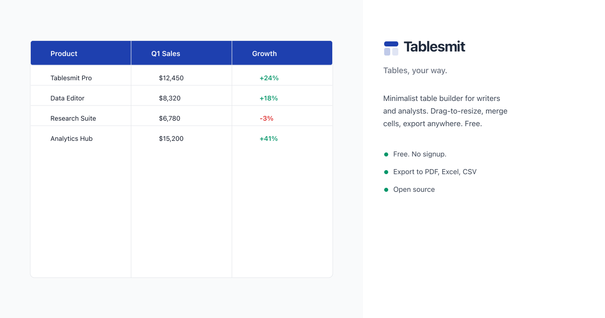

# Tablesmit

> A minimalist table builder for analytical writing.

Build clean, structured tables with full control over headers, formatting, and export.
No account. No bloat. Free and open source.

**[→ tablesmit.com](https://tablesmit.com)**

> Now with LaTeX export — build your table visually, get publication-ready TeX output.


[](https://tablesmit.com)

---

## What is Tablesmit?

Tablesmit is a browser-based table editor built for writers, analysts, and researchers who need clean, structured tables — not a spreadsheet.

**Tablesmit is not** a spreadsheet, a database, or a Notion competitor.
It is a structured writing tool. You build a table, format it, and export it.

---

## Features

### Layout and structure
- Drag-to-resize columns and rows (smooth, 60fps)
- Auto-fit column width on double-click
- Merge and unmerge cells — any rectangular range
- Freeze first row and/or first column
- Table caption with left, center, right alignment

### Formatting
- 6 table themes: Default, Minimal, Dark Header, Striped, Academic, Monochrome
- Custom header colours and content colours
- Column types: Text, Number, Currency, Percentage, Date
- Auto-sum and auto-numbering for numeric columns
- Word-style border picker: all borders, inside, outside, dashed, dotted, double
- Dark mode with system preference detection

### Data and editing
- Smart clipboard paste — Ctrl+V reads Excel, Word, and CSV clipboard content automatically
- Import: CSV and Excel files
- Column sorting — numeric-aware, empty cells to bottom
- Right-click context menu on cells and columns
- Find and replace across all cells (Ctrl+F / Ctrl+H)
- Undo stack — Ctrl+Z with depth indicator

### Export
- PDF — table only, no browser chrome
- Excel (.xlsx) — native format with merged cells preserved
- PNG and JPEG — high-resolution image
- CSV — clean, sanitised output
- Copy as image or Excel data (TSV) to clipboard

### Other
- Keyboard shortcuts (press `Ctrl+/` to see all)
- AI features scaffolding (coming soon)
- Works offline — PWA with service worker
- No account required. No data leaves your browser.

---

## Getting started

```bash
git clone https://github.com/Olayiwola72/tablesmit.git
cd tablesmit
npm install
npm run dev
```

Open [http://localhost:5173](http://localhost:5173)

### Prerequisites

- Node 18+
- npm 9+

---

## Tech stack

React 18 · TypeScript · Vite · Tailwind CSS · shadcn/ui · Vitest · Playwright

---

## Folder structure

```
tablesmit/
├── public/
│   ├── favicon.svg
│   ├── og-image.png / og-image.svg
│   ├── robots.txt
│   ├── sitemap.xml
│   ├── fonts/                     # Self-hosted woff2 font files
│   ├── icons/                     # PWA icons (192, 512)
│   ├── launch/                    # Product Hunt + HN launch copy
│   └── locales/                   # i18n JSON per language (ar, de, es, fr, ja, no, pt)
│
├── scripts/
│   ├── md-to-blog-post.ts
│   └── sitemap/
│
├── e2e/
│   └── critical-path.spec.ts
│
├── .github/workflows/
│   └── deploy-netlify.yml
│
├── src/
│   ├── assets/
│   ├── lib/                       # cn() helper (clsx + tailwind-merge)
│   ├── components/
│   │   ├── ui/                    # Primitives: Button, Logo, ErrorBoundary, etc.
│   │   ├── layout/                # Navbar, Footer, Sidebar, MobileSheet
│   │   └── features/              # TableGrid, ExportPanel, TableToolbar, etc.
│   ├── pages/                     # Lazy-loaded per route
│   ├── context/                   # TableContext, TableDataContext, TableSelectionContext
│   ├── hooks/                     # useColumnResize, useExport, useTheme, etc.
│   ├── services/                  # exportService (strategy pattern), blogService, importService
│   ├── i18n/                      # i18next init, locale config, English JSON
│   ├── utils/                     # tableUtils, mergeUtils, latexUtils, toast, etc.
│   ├── types/                     # Shared table types (cell, merge, preset, state)
│   ├── config/                    # siteConfig, changelog, presets, colorPalette, tableThemes
│   ├── constants/
│   ├── content/
│   │   ├── blog/                  # Blog posts as .ts modules (auto-discovered)
│   │   └── features/              # Feature pages as .json files (auto-discovered)
│   ├── styles/globals.css
│   ├── test/                      # All tests, mirroring src/ structure
│   ├── App.tsx                    # Router + providers only
│   └── main.tsx
│
├── tailwind.config.ts
├── vite.config.ts
├── vitest.config.ts
├── playwright.config.ts
├── tsconfig*.json
├── postcss.config.js
├── netlify.toml
├── eslint.config.js
├── .prettierrc
├── .husky/
├── CONTRIBUTING.md
├── LICENSE
└── package.json
```

All tests live in `src/test/` mirroring the source structure. Every page is lazy-loaded. Features panels within the table maker are also lazy-loaded.

---

## Project status

```
Tests:     1368 passing — 140 test files
Lint:      0 warnings — TypeScript strict
Build:     clean — no errors
Coverage:  lines 75%+ · functions 65%+ · branches 60%+
PWA:       offline-capable with auto-updating service worker
```

---

## Configuration

All product decisions — brand name, routes, nav links, export formats, colour palettes, and presets — are in one file:

```
src/config/siteConfig.ts
```

Check there first before changing component logic. Agents reading this repo: `siteConfig.ts` is the single source of truth for anything brand or route related.

---

## Writing a blog post

Drop a `.ts` file into `src/content/blog/`. The post appears automatically — no registry, no code change.

```ts
// src/content/blog/your-post.ts
import type { BlogPost } from '../../services/blogService/blogService.types'

const post: BlogPost = {
  slug:        'your-post-slug',       // URL slug — kebab-case
  title:       'Your Post Title',
  date:        '2025-11-01',
  description: 'One or two sentences. Max 160 chars.',
  author:      'Your Name',
  tags:        ['tag-one', 'tag-two'],
  readTime:    4,
  featured:    false,                   // true pins to top of list
  content:     `## First heading

Your Markdown content here.

Link to the app: [build your table](/).`,
}

export default post
```

That's it. Commit and push — GitHub Actions builds and deploys to Netlify.

---

## Adding a feature page

Drop a `.json` file into `src/content/features/`. No code change. See `AGENTS.md` Section 59 for the full schema and examples.

---

## Contributing

See [CONTRIBUTING.md](./CONTRIBUTING.md) for full guidelines.

Quick summary:
- Open an issue before starting large changes
- Run `npm test` — all tests must pass
- Run `npm run lint` — zero warnings
- No `console.log` in production code
- Write tests for new features

```bash
# Run tests
npm test

# Run tests with coverage
npm run test:coverage

# Run lint
npm run lint

# Build
npm run build
```

---

## Environment variables

Copy `.env.example` and fill in your values:

```bash
cp .env.example .env
```

See `.env.example` for all available variables. Never commit `.env`.

---

## Deployment

Tablesmit deploys to Netlify via GitHub Actions on push to `main`.
The pipeline runs lint, tests, and build before deploying.

Required Netlify environment variables:
- `VITE_GA4_MEASUREMENT_ID`
- `VITE_SENTRY_DSN`
- `VITE_APP_URL`

---

## License

MIT — see [LICENSE](LICENSE)

---

Built with care in Nigeria. Sponsored by the community.
[Support this project →](https://tablesmit.com/open-source) · [Blog](https://tablesmit.com/blog) · [GitHub](https://github.com/Olayiwola72/tablesmit)
