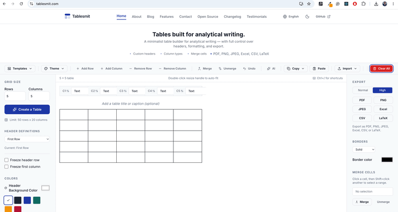

# Tablesmit

> A minimalist table builder for analytical writing.

Build clean, structured tables with full control over headers, formatting, and export.
No account. No bloat. Free and open source.

**[→ tablesmit.com](https://tablesmit.com)**


---

<p align="center">
  
</p>

---

## Screenshots

<p align="center">
  
  
</p>
<p align="center">
  
</p>

---

## What is Tablesmit?

Tablesmit is a browser-based table editor built for writers, analysts, and researchers who need clean, structured tables — not a spreadsheet.

**Tablesmit is not** a spreadsheet, a database, or a Notion competitor. It is a structured writing tool. You build a table, format it, and export it.

---

## Features

### Layout and structure
- Drag-to-resize columns and rows (smooth, 60fps via `requestAnimationFrame`)
- Auto-fit column width / row height on double-click
- Merge and unmerge cells — any rectangular range
- Freeze first row and/or first column (sticky CSS)
- Table caption with left, center, right alignment and custom colours

### Formatting
- 6 table themes: Default, Minimal, Dark Header, Striped, Academic, Monochrome
- Custom header colours and content colours
- Column types: Text, Number, Currency, Percentage, Date, Sum, Auto-number
- Auto-sum footer row for numeric columns
- Word-style border picker: all, inside, outside, top, bottom, left, right — plus dashed, dotted, double, thick box
- Dark mode with system preference detection + manual toggle

### Data and editing
- Smart clipboard paste — Ctrl+V reads Excel, Word, CSV, Markdown pipes, and LaTeX tabular automatically
- Import: CSV (PapaParse), Excel (exceljs), and LaTeX (tabular with colors)
- Export: PDF, PNG, JPEG, Excel (.xlsx), CSV, LaTeX (.tex)
- Copy: Excel Data (TSV), CSV, Markdown, LaTeX, HTML, Image (PNG)
- Column sorting — numeric-aware, empty cells to bottom, disabled when merged ranges present
- Right-click context menu on cells and column headers
- Find and replace across all cells (Ctrl+F / Ctrl+H)
- Undo stack — Ctrl+Z with 50-entry depth

### Accessibility
- Full ARIA grid pattern (`role="grid"`, `role="gridcell"`, `aria-colindex`, etc.)
- Keyboard navigation via Arrow keys, Tab, Enter, Escape
- Live region announcements for structural changes
- `prefers-reduced-motion` respected throughout
- 4.5:1 minimum contrast on all text

### Other
- Internationalisation: 8 languages (English, Arabic, French, Spanish, Portuguese, Japanese, German, Norwegian)
- RTL support for Arabic
- Keyboard shortcuts — press `?` or `Ctrl+/` to see all 13
- Offline-capable PWA with auto-updating service worker + version polling
- LaTeX import (round-trip safe — strips `\textcolor`, `\textbf`, `\colorbox`, `\rowcolor`, `\columncolor`)
- 30 feature landing pages, 36 blog posts
- No account required. No data leaves your browser.

### Export / Copy formats

| Format | Export | Copy |
|--------|:------:|:----:|
| PDF | ✅ | — |
| PNG | ✅ | — |
| JPEG | ✅ | — |
| Excel (.xlsx) | ✅ | — |
| CSV | ✅ | ✅ |
| LaTeX | ✅ | ✅ |
| Markdown | — | ✅ |
| HTML | — | ✅ |
| Image (PNG) | — | ✅ |
| Excel Data (TSV) | — | ✅ |

---

## Getting started

```bash
git clone https://github.com/Olayiwola72/tablesmit.git
cd tablesmit
npm install
npm run dev
```

Open [http://localhost:5173](http://localhost:5173)

### Prerequisites

- Node 18+
- npm 9+

---

## Tech stack

| Layer | Technology |
|---|---|
| Framework | React 18 + Vite |
| Language | TypeScript — `strict: true` |
| Styling | Tailwind CSS v3 + `@tailwindcss/typography` |
| Components | shadcn/ui (Radix primitives) |
| Icons | Lucide React |
| Drag / Resize | `@dnd-kit/core` + `@dnd-kit/utilities` |
| Export | jsPDF + html2canvas (PDF/PNG), exceljs (Excel), PapaParse (CSV) |
| Import | PapaParse (CSV), exceljs (Excel) |
| Testing | Vitest + React Testing Library + `@testing-library/user-event` |
| E2E | Playwright |
| Routing | React Router v6 (lazy-loaded pages) |
| i18n | i18next + react-i18next + `i18next-browser-languagedetector` |
| Markdown | react-markdown + remark-gfm |
| SEO | react-helmet-async (per-page meta, JSON-LD) |
| Error monitoring | Sentry (lazy-loaded, production only) |
| Toast | sonner |
| Button variants | class-variance-authority + clsx |
| PWA | vite-plugin-pwa |
| Git hooks | husky + lint-staged |

---

## Folder structure

```
tablesmit/
├── public/
│   ├── favicon.svg
│   ├── og-image.png / og-image.svg
│   ├── robots.txt
│   ├── sitemap.xml
│   ├── llms.txt                    # LLM-friendly project summary (llmstxt.dev)
│   ├── fonts/                       # Self-hosted Inter + JetBrains Mono woff2
│   ├── icons/                       # PWA icons (192, 512)
│   ├── launch/                      # Product Hunt + HN launch copy
│   └── locales/                     # i18n JSON per language (ar, de, es, fr, ja, no, pt)
│
├── scripts/
│   ├── prerender.ts                  # Playwright-based prerender — run locally before content commits
│   ├── version.cjs                   # Writes dist/version.json with DEPLOY_ID or timestamp
│   ├── md-to-blog-post.ts            # .md → blog .ts file converter
│   └── sitemap/generate-sitemap.ts        # Sitemap generator
│
├── e2e/
│   └── critical-path.spec.ts
│
├── .github/workflows/
│   └── deploy-netlify.yml            # CI/CD: lint → test → build → deploy
│
├── src/
│   ├── assets/
│   │   └── logo.svg                  # Full logo SVG (reference only — rendered as React component)
│   ├── lib/
│   │   ├── utils.ts                  # cn() helper (clsx + tailwind-merge)
│   │   └── sentry.ts                 # Lazy Sentry init — never eagerly imported
│   ├── components/
│   │   ├── ui/                       # Reusable primitives: Button, Logo, ErrorBoundary, IconButton, Tooltip, DropdownMenu, SectionLabel, TableSkeleton, etc.
│   │   ├── layout/                   # Navbar, Footer, Sidebar, MobileSheet, PageWrapper
│   │   └── features/                 # Domain components: TableGrid, ExportPanel, TableToolbar, BorderPanel, FindReplace, TableCaption, ThemePicker, etc.
│   ├── pages/                        # 13 lazy-loaded pages (About, Blog, BlogPost, Contact, Features, FeatureDetail, OpenSource, Privacy, Terms, Changelog, Testimonials, 404, TableMaker)
│   ├── context/                      # TableContext (cells) + TableSelectionContext (selection) + TableProvider (everything else) + TableReducer (reducer + helpers) — split to minimise re-renders
│   ├── hooks/                        # 19 hooks: useColumnResize, useExport, useImport, useClipboardPaste, useFindReplace, useTableHistory, useTheme, useMergeCells, useTableFocus, useBlogSearch, useFeatureSearch, usePageTranslation, etc.
│   ├── services/                     # exportService (strategy pattern), importService, blogService, featureService, tableHtmlBuilder, clipboardParser
│   ├── i18n/                         # i18next init, locale config, English JSON source of truth
│   ├── utils/                        # tableUtils, mergeUtils, latexUtils, markdownUtils, formatUtils, searchUtils, colorUtils, cell, toast, analytics, dateUtils
│   ├── types/                        # Shared table types: CellData, MergeRange, HeaderStyle, TableTheme, PresetDefinition, etc.
│   ├── config/                       # Per-domain config: brand, routes, nav, copy, export, import, table, etc.
│   ├── constants/
│   ├── content/
│   │   ├── blog/                     # 34 blog posts as .ts modules (auto-discovered via import.meta.glob)
│   │   └── features/                 # 30 feature pages as .json (auto-discovered)
│   ├── styles/globals.css            # Tailwind directives + @font-face + print styles + dark mode
│   ├── test/                         # 186 test files mirroring src/ structure
│   ├── App.tsx                       # Router + providers only — zero business logic
│   ├── main.tsx                      # ReactDOM root + Sonner Toaster
│   ├── pwa.ts                        # Service worker registration + version polling
│   └── index.scss                    # SCSS entry
│
├── tailwind.config.ts
├── vite.config.ts                    # manualChunks for vendor splitting
├── vitest.config.ts                  # jsdom environment, coverage thresholds
├── playwright.config.ts
├── tsconfig*.json
├── postcss.config.js
├── netlify.toml                      # CSP, security headers, SPA redirects
├── eslint.config.js                  # Flat config with recommended presets only
├── .husky/
├── CONTRIBUTING.md
├── LICENSE
└── package.json
```

Every page is lazy-loaded. Heavy feature panels within the table maker are also lazy-loaded. All tests live in `src/test/` mirroring source structure — no co-located `.test` files.

---

## Project status

```
Tests:     1936 passing — 186 test files
Lint:      TypeScript strict — zero custom rules
Build:     clean — code-split chunks < 150 KB gzipped initial
PWA:       offline-capable with auto-updating service worker
Coverage:  utils 95%+ · services 90%+ · hooks 90%+ · components 80%+
Lighthouse Performance: 99 — LCP 0.9s, CLS 0
```

---

## Configuration

Product decisions — brand name, routes, nav links, export formats, color palettes,
and presets — live in per-domain config files under `src/config/`. Each domain owns
its own file; consumers import exactly what they need.

| Domain | File |
|---|---|---|
| Brand name, tagline, URLs | `src/config/brand/brandConfig.ts` |
| Route paths + nav links | `src/config/routes/routesConfig.ts` |
| Export formats + quality presets | `src/config/export/exportConfig.ts` |
| Import limits | `src/config/import/importConfig.ts` |
| Keyboard shortcuts | `src/config/shortcuts/shortcutsConfig.ts` |
| Table themes | `src/config/table/tableThemes/tableThemes.ts` |
| Table defaults + constraints | `src/config/table/tableDefaults/tableDefaults.ts` |
| Table presets | `src/config/table/presets/` |
| Changelog entries | `src/config/changelog/changelog.ts` |
| Color palette swatches | `src/config/colorPalette/colorPalette.ts` |
| Column formats | `src/config/columnFormats/columnFormatsConfig.ts` |
| Locale metadata | `src/config/locale/localesConfig.ts` |
| Analytics | `src/config/analytics/analyticsConfig.ts` |
| Sponsors | `src/config/sponsors/sponsorsConfig.ts` |
| Page content + testimonials | `src/config/testimonials/testimonials.ts` |

See `src/config/` for the complete list. Check there before changing component logic.

---

## Writing a blog post

Drop a `.ts` file into `src/content/blog/`. The post appears automatically — no registry, no code change.

```ts
// src/content/blog/your-post.ts
import type { BlogPost } from '../../services/blogService/blogService.types'

const post: BlogPost = {
  slug:        'your-post-slug',       // URL slug — kebab-case
  title:       'Your Post Title',
  date:        '2025-11-01',
  description: 'One or two sentences. Max 160 chars.',
  author:      'Your Name',
  tags:        ['tag-one', 'tag-two'],
  readTime:    4,
  featured:    false,                   // true pins to top of list
  content:     `## First heading

Your Markdown content here.

Link to the app: [build your table](/).`,
}

export default post
```

That's it. Commit and push — GitHub Actions builds and deploys to Netlify.

---

## Adding a feature page

Drop a `.json` file into `src/content/features/`. The slug is derived from the filename or the `slug` field. See `AGENTS.md` Section 59 for schema details.

---

## Contributing

See [CONTRIBUTING.md](./CONTRIBUTING.md) for full guidelines.

Quick summary:
- Open an issue before starting large changes
- No direct pushes to `main` — all changes go through PRs
- Run `npm test` — all 1781 tests must pass
- Run `npm run lint` — zero warnings
- Write tests for new features

```bash
# Run tests
npm test

# Run tests with coverage
npx vitest run --coverage

# Run lint
npm run lint

# Build (generates sitemap + bundles app + copies prerendered content + writes version.json)
npm run build

# Prerender static HTML for content pages (run locally before content commits)
npm run prerender
```

---

## Environment variables

Copy `.env.example` and fill in your values:

```bash
cp .env.example .env
```

See `.env.example` for all available variables. Never commit `.env`.

---

## Prerendering content pages

Content pages (About, Blog, Features, etc.) are prerendered as static HTML for
SEO and social previews. The homepage stays as a live SPA.

**Local workflow:**

```bash
# After adding or editing blog posts, feature pages, or any content:
npm run prerender

# This generates static HTML into prerendered/ using Playwright.
# Commit prerendered/ alongside your content changes.
```

**How it works:**

```
npm run prerender           → Playwright visits routes, writes HTML to prerendered/
git add prerendered/         → prerendered content is committed to git
npm run build                → vite build + copies prerendered/ into dist/
Netlify deploy               → content pages served as static HTML
```

The homepage (`/`) is never prerendered — it remains an interactive SPA.
The `prerendered/` folder is committed to git so CI never needs Playwright.

## Deployment

Tablesmit deploys to Netlify via GitHub Actions on push to `main`.
The pipeline runs lint, test, and build before deploying.

Required Netlify environment variables:
- `VITE_GA4_MEASUREMENT_ID`
- `VITE_SENTRY_DSN`
- `VITE_APP_URL`

---

## Contact

Questions or feedback: [hello@tablesmit.com](mailto:hello@tablesmit.com)

---

## License

MIT — see [LICENSE](LICENSE)

---

Built with care in Nigeria. Sponsored by the community.
[Support this project →](https://tablesmit.com/open-source) · [Blog](https://tablesmit.com/blog) · [GitHub](https://github.com/Olayiwola72/tablesmit)
